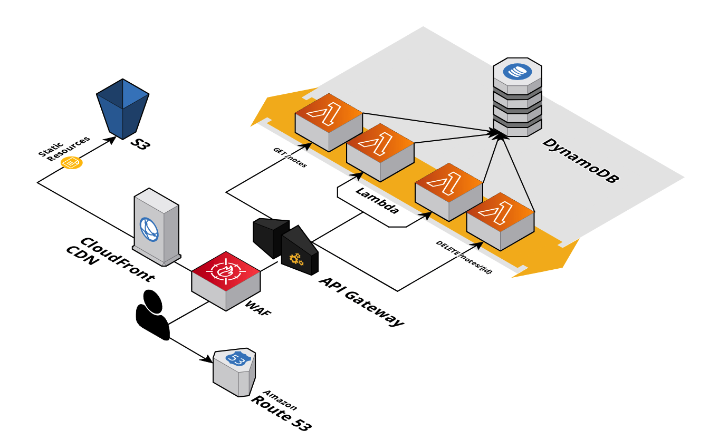
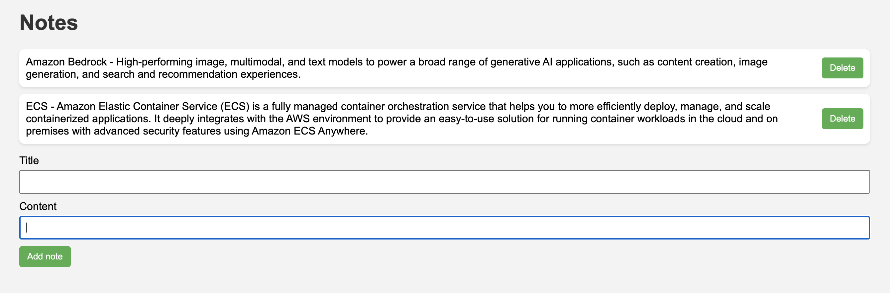

# Serverless Application in Terraform

___
## Introduction
The Terraform code in this repository allows deploying an infrastructure capable of hosting a static frontend and a backend compatible with the serverless paradigm. The choice of this stack is dictated by the scalability and high inherent availability of AWS serverless managed services.

This is a simplified architecture diagram of the architecture implemented in this project:



Alternatively, there are more classical three-tier architectures that involve the use of EC2 instances or container orchestrators (on ECS or EKS) to host presentation and logic layers. For the data layer, it is possible to use SQL databases (on RDS) or NoSQL databases (DocumentDB, MongoDB) (*).


To test the entire solution, a very simple frontend and backend application has been developed. The webapp allows saving and deleting short text notes. The backend has been developed in Python, while the frontend is made up of simple HTML code and vanilla Javascript.



To execute the Terraform code deployment and state management, Terraform Cloud has been used.


## 1. Developer Guide

The IaC has been developed with Terraform. Git flow has been used on the Git repository for better branch management.

The architecture can be deployed on different environments with different parameters. Terraform Cloud has been used for the deployment of the Terraform code.
Even the creation and configuration of workspaces, variables, and variable sets in Terraform Cloud have been managed through Terraform.

The repository is organized in the following way::

```
root
├── LICENSE
├── README.md
└── terraform
    ├── live
    │   ├── backend
    │   │   ├── api    - backend logic resources (lambda, dynamodb, api gateway ...)
    │   │   └── cicd   - backend CI/CD resources
    │   ├── frontend
    │   │   ├── cicd   - frontend CI/CD resources
    │   │   └── webapp - resources for the frontend distribution (s3, cloudfront ...)
    │   └── network    - networking and route53 configuration
    └── tfc - configuration of the Terraform Cloud workspaces and variable sets.
```

## 2. Architectural choices

### Network:
This workspace allows for the creation and configuration of a VPC and related resources on AWS, allowing for customization of the number of public and private subnets and other settings through various parameters.

For a fully serverless infrastructure, it would not be necessary to deploy a VPC. However, this code has been implemented for possible future evolutions that may require resources that need a VPC.

#### VPC
 During the creation of the VPC, public and private subnets are generated across different availability zones using the `azs` parameter. 
 
 Furthermore, it's possible to configure DNS and NAT Gateway settings using the `enable_dns_hostnames`, `enable_nat_gateway`, and `single_nat_gateway` parameters, allowing for cost optimization and infrastructure reliability.
 
 For production environments, it is recommended to set the `single_nat_gateway` parameter to `false` to create a NAT gateway for each AZ (one per NAT subnet), while for development environments, a single NAT gateway can be used to reduce costs.

#### Route53
The stack creates two types of Route53 zones, public and private. The creation is controlled by the var.domain_name and var.create_private_hosted_zone parameters, allowing maximum flexibility in managing domain name resolutions. The creation of a public hosted zone may not be necessary when you don't have a custom domain name.

#### ACM
Finally, ACM is employed to create, associate, and manage the SSL certificates required to expose Cloudfront and API Gateway through a custom domain name.


### Frontend:
The Frontend workspace manages the resources necessary for creating and provisioning a static frontend based on Amazon AWS S3 and CloudFront.

#### S3
The frontend is hosted on an S3 bucket. To ensure security and compliance with best-practices, several options are set, such as blocking public ACLs and restricting access to the bucket only.

#### CloudFront
To ensure shorter response times, caching and a reduced number of costly requests to S3, a CloudFront distribution is created. Furthermore, an ACM certificate is generated in the us-east-1 region and associated with CloudFront if a custom domain is needed.

An Origin Access Identity is configured on CloudFront to limit access to the S3 bucket only through CloudFront.

#### WAF
AWS WAFv2 is used to protect the frontend from potential attacks. A WebACL is created with configurable rules to limit request frequency and block bots.

#### CI/CD
- **Source**</br>
The source code is fetched from the private Git repository by CodePipeline. A CodeStar connection is used to securely obtain the code. Depending on the environment (controlled by the `environment` variable), the appropriate branch from which to fetch the application code is selected.

- **Deploy**</br>
The webapp code is then deployed to the S3 bucket mentioned previously.

- **CacheInvalidation**</br>
Finally, a Lambda function is executed to invalidate CloudFront cache. This action ensures that the static frontend is always up-to-date in CloudFront's edge locations.

### Backend:
The Backend workspace creates and manages the resources necessary for a serverless stack, using DynamoDB as the datastore, Lambda for application logic, and API Gateway to expose CRUD APIs.

#### DynamoDB
The DynamoDB table named "notes" will contain the notes entered by the user. The `billing_mode` can be set based on the volume of requests the table will handle.

#### Lambda
Lambda functions are dynamically created based on the number of APIs to be served. As with the other resources, the role of the Lambda functions follows the least privilege best-practice, allowing them only the minimum necessary actions.

#### API Gateway
For API exposure, an API Gateway has been configured. The API Gateway has the necessary permissions to write logs in CloudWatch to enable debugging and access control to the backend. Requests to the various endpoints are routed to the corresponding Lambda functions through the AWS_PROXY integration.

#### CI/CD:
The CodePipeline service has also been used in the case of the backend.
The pipeline consists of the following stages:
- **Source**</br>
In the Source stage, the source code is fetched from the repository. The `CodeStarSourceConnection` provider is used to obtain the source code from the desired repository on GitHub. The branch name is again chosen depending on the current environment (development or production).

- **Deploy**</br>
In the Deploy stage, CodeDeploy has been configured to make sure the source code is deployed to the Lambda functions that make up the backend.

In order to allow automatic rollbacks in case of bugs being introduced in new releases, Cloudwatch Alarms have been set up to monitor the API Gateway responses (5XX errors and integration latency with Lambda).

Furthermore, the deployment strategy is parametrized. By default, the canary strategy has been chosen.

Using this CodePipeline configuration, it is possible to successfully manage continuous integration and deployment of the serverless backend, ensuring fast release times and a reliable and automated workflow.

### Improvement opportunities:

There are many optimization and improvement opportunities for the project. The following are the ones identified and reported in the GitHub repository issues:

1. **Testing**: Currently, the CI/CD pipelines do not include an application testing stage. Introducing unit tests and integration tests would make deploying new releases to production even more secure.
2. **Authentication**: It is crucial to include an API authorization and authentication system. It has not been implemented in this project phase to allow for the free use of the application and to avoid implementing the frontend logic required for authentication. A feasible idea involves adopting Amazon Cognito to handle frontend login and generate a token that is easily verified by API Gateway.
3. **Security**: Using WAF to protect the frontend from attacks and bot traffic could be extended to the API Gateway. To do this, a Cloudfront distribution must be attached due to WAF's incompatibility with the chosen API Gateway type (HTTP).

(*): Among the repositories in my GitHub account, it is possible to consult examples of container-oriented three-tier architectures developed in the past. In these cases, the chosen IaC language was CDK Python.

- [aws-cdk-ecs-wordpress](https://github.com/christian-calabrese/aws-cdk-ecs-wordpress)
- [aws-cdk-eks-web-server](https://github.com/christian-calabrese/aws-cdk-eks-web-server)
___
<h4 style="text-align: right">Christian Calabrese</h4>
